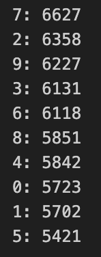

# Table of Contents

1. [Introduction](#introduction)
2. [Model Selection and Development](#model-selection-and-development)
   - [MLP Architecture](#mlp-architecture)
   - [CNN Architecture](#cnn-architecture)
   - [Hyperparameters](#hyperparameters)
   - [Design Choices](#design-choices)
3. [Data Augmentation Strategy](#data-augmentation-strategy)
    - [The Two Approaches](#the-two-approaches)
    - [Additional Considerations](#additional-considerations)
3. [Evaluation and Hyperparameter Tuning](#evaluation-and-hyperparameter-tuning)
4. [Training Process](#training-process)
5. [Results and Discussion](#results-and-discussion)
   - [Model Performance](#model-performance)
   - [Analysis of Custom Handwritten Digits](#analysis-of-custom-handwritten-digits)
   - [Key Takeaways](#key-takeaways)

## Introduction
This document outlines the process and results for the Convolutional Neural Network (CNN) and Multi-Layer Perceptron (MLP) models created with PyTorch.

## Model Selection and Development

### MLP Architecture

**Structure:**

- Input layer: 784 neurons
- Hidden layer: 1024 neurons
- Hidden layer: 128 neurons
- Output layer: 10 neurons

**Activation Functions:**

- Hidden layers: Leaky ReLU
- Output layer: Softmax

**Loss Function:** Categorical Cross-Entropy  
**Regularization:** Dropout was used to prevent overfitting

### CNN Architecture

**Structure:**

- 2 convolution layers, each followed by Leaky ReLU activation and max pooling
- Final feature map flattened and input into an MLP:
  - Input layer: 3,136 neurons
  - Hidden layer: 128 neurons
  - Output layer: 10 neurons

**Activation Functions:**

- Convolution and hidden layers: Leaky ReLU
- Output layer: Softmax

**Loss Function:** Categorical Cross-Entropy  
**Regularization:** Dropout was used to prevent overfitting

## Hyperparameters

Viewable in the `config/` directory.

### Design Choices

- **Hyperparameter Tuning**: Used grid search for hyperparameter tuning, with each hyperparameter combination evaluated using 10-fold cross-validation. For each set of hyperparameters, the mean validation accuracy across all folds was used as the evaluation statistic. 
- **Loss Function**: Chose softmax categorical cross-entropy to penalize incorrect predictions more severely compared to alternative loss functions like mean squared error.
- **Leaky ReLU Activation**: Selected for effectiveness in mitigating vanishing gradient problem compared to other activations like sigmoid. Leaky ReLU performed better than standard ReLU in experiments.

## Data Augmentation Strategy
### The Two Approaches
- Data augmentation was used to improve generalizability of model
- Hyperparameter `prop_augment` represents the proportion of the training data that is augmented
    - For both models `prop_augment` was 0.3, indicating 30% of the training data was augmented while the other 70% was normalized

- The defined augmentation transformation was a combination of various techniques (e.g., rotation, shear, changing brightness)

- Two approaches (also detailed in pages 7-8 of `notes.pdf`) were developed to maintain consistent proportion of normalized and augmented data consistent during each fold of cross-validation and without augmenting the validation set

 
<figure>
  
  <figcaption>Figure 1: Visualization of Approach 1.</figcaption>
</figure>

#### Approach 1
1. For each fold in k-fold cross-validation (e.g., 10 times for 10-fold cross-validation) with untransformed train dataset:
    - Use the generated train/validation indices to create train/validation subset
    - Take a subset of just the training data
    - Split the training data into two subsets (70% and 30% of training data) 
    - Apply normalization transformation to the larger subset (70%)
    - Apply augmentation transformation to the smaller subset (30%)
    - Merge these back together to get the new training data
    - Train and evaluate model on validation subset
_Note: For final training with full train data, skip the first two steps and evaluate model on test dataset instead_

 
<figure>
  
  <figcaption>Figure 2: Visualization of Approach 2.</figcaption>
</figure>

#### Approach 2
1. Create an augmented train dataset with samples in the same order as the normalized train dataset
2. For each fold in k-fold cross-validation (e.g., 10 times for 10-fold cross-validation) with normalized train dataset:
    - Use the generated train/validation indices to create train/validation subset
    - Concatenate this train/validation subset with the augmented dataset
    - Map the indices of normalized dataset to augmented dataset by adding len(normalized_dataset)
    - Select 70% of the indices for the new training dataset from the normalized part and 30% from the augmented part
    - Merge these back together to get new training data
    - Train and evaluate model on validation subset
_Note: For final training, concatenate all normalized training examples from MNIST dataset with augmented dataset; evaluate model on test dataset instead_

 

  <figure style="text-align: center;">
    
    <figcaption>Figure 3: Original Distribution of Classes in Augmented Dataset.</figcaption>
  </figure>
  <figure style="text-align: center;">
    
    <figcaption>Figure 4: Altered Distribution of Classes in Augmented Dataset.</figcaption>
  </figure>

### Additional Considerations
- The distribution of classes in MNIST dataset is uneven; the classes with more samples (e.g., 1) had a higher recall
- Therefore, in Approach 2, the classes in the augmented dataset were redistributed before the concatenation to contain more of the classes that the model did not correctly identify to account for this
- Approach 2 resulted in a higher validation accuracy than Approach 1, so it was used for the final model training

## Training Process
- Once the optimal hyperparameters were chosen, the full train dataset was used to train the model using Approach 2 (as described above). 
- The model was trained repeatedly, and the version with the best generalization performance was selected.

## Evaluation and Hyperparameter Tuning

- With the corresponding hyperparameters in **`config/`**:
    - The MLP had a top mean validation accuracy of 98.60%. 
    - The CNN had a top mean validation accuracy of 99.21%

<figure>
  
  <figcaption>Figure 5: MLP Confusion Matrix.</figcaption>
</figure>

- After choosing the hyperparameters and training the model with the full train dataset, the confusion matrix was analyzed with statistics including F1 score, precision, accuracy, and recall
- To improve performance, in the augmented dataset, numbers that had a higher recall were replaced with numbers that had a lower recall 
- This strategy increased the chance of chosen augmented elements being from a class that the model previously identified poorly
    - Individually applied this strategy to each model (e.g., MLP augmented dataset was populated with more '7' samples than CNN augmented dataset)
- After retraining with this strategy, both the CNN and MLP generalization improved

## Results and Discussion

### Model Performance

- MLP
    - **Final Train Accuracy**: 99.37%
    - **Final Test Accuracy**: 99.02%
- CNN
    - **Final Train Accuracy**: 99.75%
    - **Final Test Accuracy**: 99.56%

### Analysis of Custom Handwritten Digits

- The models were tested on new handwritten digit samples in `test-images` (drawn by myself) to further analyze their generalizability

<figure>
  
  <figcaption>Figure 6: Custom handwritten digit</figcaption>
</figure>

For a sample handwritten digit ''9'
- The MLP correctly classified the digit with 72.21% confidence
- The CNN correctly classified the digit with 99.86% confidence
    - This could be because the CNN, which has pattern recognition capabilities from its convolution layers, can handle out-of-distribution characteristics (e.g., pixel brightness, digit thickness) better than an MLP

### Key Takeaways

1. Model Performance:
    - Neither the CNN nor the MLP model underfits or overfits to the training data
    - Both models demonstrate high accuracy on the MNIST test dataset

2. Generalization to Out-of-Distribution Data:
    - The MLP struggles significantly more than the CNN when dealing with the out-of-distribution `test-images` data (handwritten digits I drew)
    - Suggests that the CNN has better generalization capabilities for real world data

3. Data Augmentation Strategy:
    - Approach 2 for data augmentation performed better than Approach 1, possibly because of the following:
        - Greater similarity between the normalized and augmented training examples, resulting from mapping indices onto augmented versions of the normalized images
        - This similarity could lead to better learning, as the model sees more consistent data, rather than augmentations of unseen images in each batch