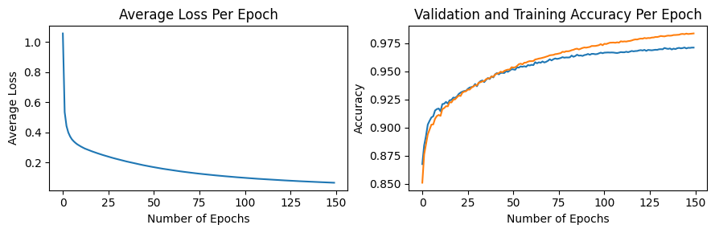

# Table of Contents

1. [Introduction](#introduction)
2. [Model Selection and Development](#model-selection-and-development)
   - [MLP Architecture](#mlp-architecture)
   - [Hyperparameters](#hyperparameters)
   - [Design Choices](#design-choices)
   - [Implementation Details](#implementation-details)
3. [Evaluation and Hyperparameter Tuning](#evaluation-and-hyperparameter-tuning)
   - [Tuning Strategies](#tuning-strategies)
4. [Training Process](#training-process)
   - [Training Procedure](#training-procedure)
5. [Results and Discussion](#results-and-discussion)
   - [Model Performance](#model-performance)
   - [Analysis of Custom Handwritten Digits](#analysis-of-custom-handwritten-digits)
   - [Key Takeaways](#key-takeaways)

## Introduction

This document outlines the process and results for the multilayer perceptron (MLP) created from scratch.

## Model Selection and Development

### MLP Architecture

- **Structure**: Input layer (784 neurons) -> Hidden layer (1024 neurons) -> Output layer (10 neurons)
- **Activation Functions**: ReLU (hidden layer), Softmax (output layer)
- **Loss Function**: Categorical Cross-Entropy

### Hyperparameters

- Hidden layer neurons: 1024
- Batch size: 128
- Learning rate: 0.01
- Number of epochs: 150
- Optimization: Mini-batch gradient descent

### Design Choices

- **Hyperparameter Tuning**: Implemented a custom grid search algorithm on an 80-20 train-validation split. The validation set was not chosen by first shuffling indices, as the MNIST dataset is pre-shuffled. The best model with the corresponding hyperparameters in **`config/`** achieved 97.12% validation accuracy.
- **Loss Function**: Chose softmax categorical cross-entropy to penalize incorrect predictions more severely compared to alternative loss functions like mean squared error.
- **Weight Initialization**: Implemented He initialization, which initializes weights to small values around 0, to prevent vanishing gradient (although this is not as common an issue for ReLU).
- **ReLU Activation**: Selected for effectiveness in mitigating vanishing gradient problem compared to other activations like sigmoid. Leaky ReLU was also tested to address potential dying neurons issues caused by ReLU's derivative of 0 for negative inputs. However, standard ReLU activation performed better than Leaky ReLU.

### Implementation Details

- Inspired by PyTorch's modular design, created separate classes for the model, optimizer, and criterion
- Ensured correct matrix shapes and took subsets of the matrices for mini-batch gradient descent
- Derived backpropagation formulas for this specific MLP architecture **(see pages 18-20 in `notes.pdf`)**

## Evaluation and Hyperparameter Tuning

### Tuning Strategies

- Implemented a custom grid search algorithm to explore the hyperparameters (e.g., hidden neurons, batch size)
- Selected the model with the highest validation accuracy

<figure>
  
  <figcaption>Figure 1: Training the model with train/validations subsets.</figcaption>
</figure>

 - During grid search, analyzed Figure 1 with different sets of hyperparameters to visualize how loss and train/validation accuracy were affected

## Training Process

### Training Procedure

- Initialized model parameters using He initialization
- Implemented mini-batch gradient descent
- Applied backpropagation using custom-derived formulas (on pages 18-20 of `notes.pdf`)
- Monitored training progress with loss and accuracy metrics
- Trained for 150 epochs on full train data

## Results and Discussion

### Model Performance

- **Final Train Accuracy**: 98.55%
- **Final Test Accuracy**: 97.47%

### Analysis of Custom Handwritten Digits

- The model was tested on new handwritten digit samples in `test-images` (drawn by myself) to further analyze its generalizability

<figure>
  
  <figcaption>Figure 2: Custom handwritten digit</figcaption>
</figure>

- The model correctly classified this example as '8' with 79.76% confidence
- Overall performance on custom digits was lower than the test set accuracy
- Suspect this reduced performance was due to out-of-distribution characteristics (e.g., pixel brightness, digit thickness) compared to MNIST dataset

### Key Takeaways

- The MLP does not underfit or overfit to the training data and demonstrates high accuracy on the MNIST test dataset
- The use of a single train/validation split rather than k-fold cross validation may have caused some error or noise in model evaluation during hyperparameter tuning
- It does not perform as well on the out-of-distribution `test-images`, and could likely be further improved with more advanced optimizers (e.g., Adam) and a more complex architecture.
